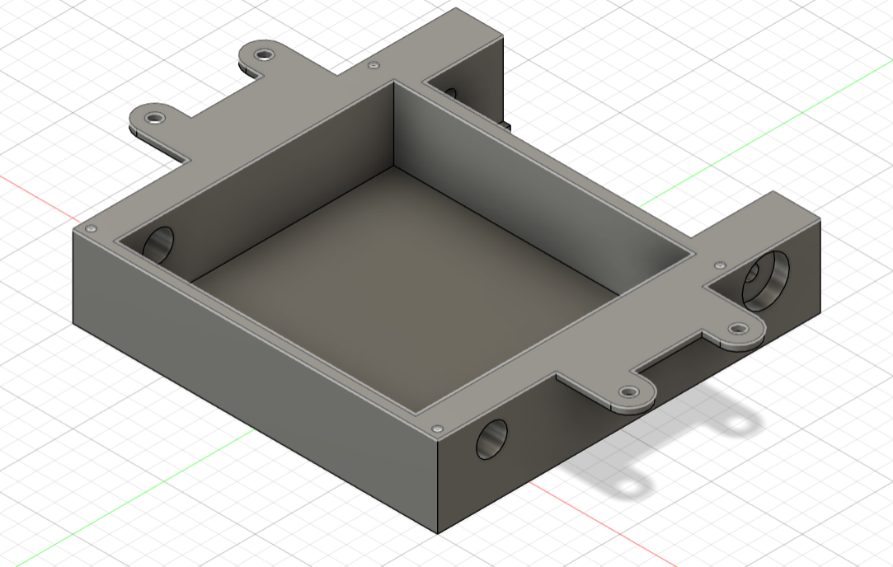
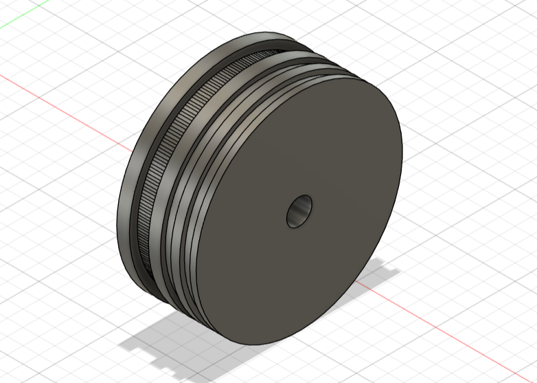
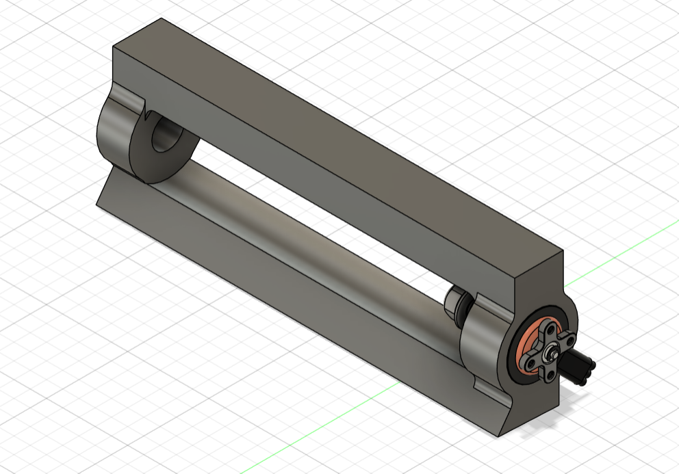
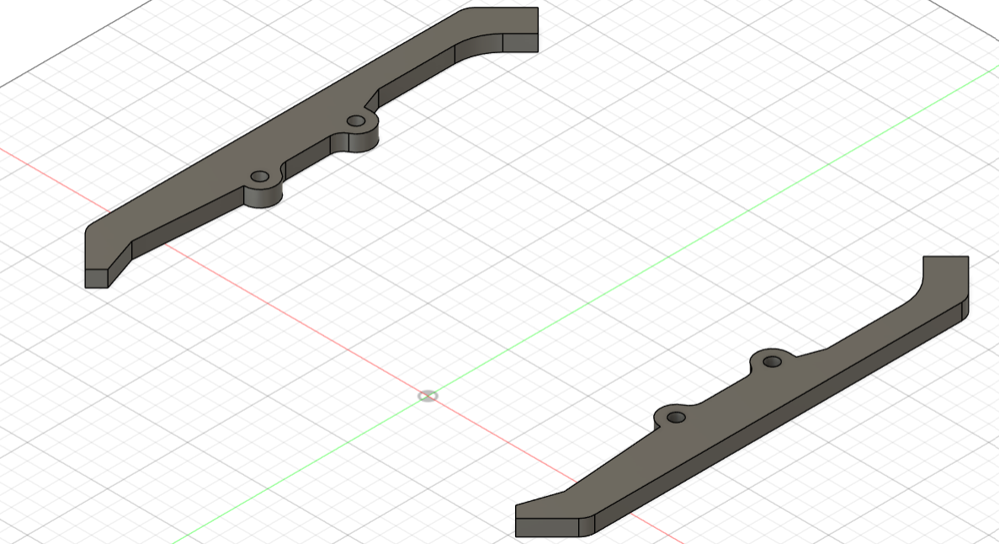
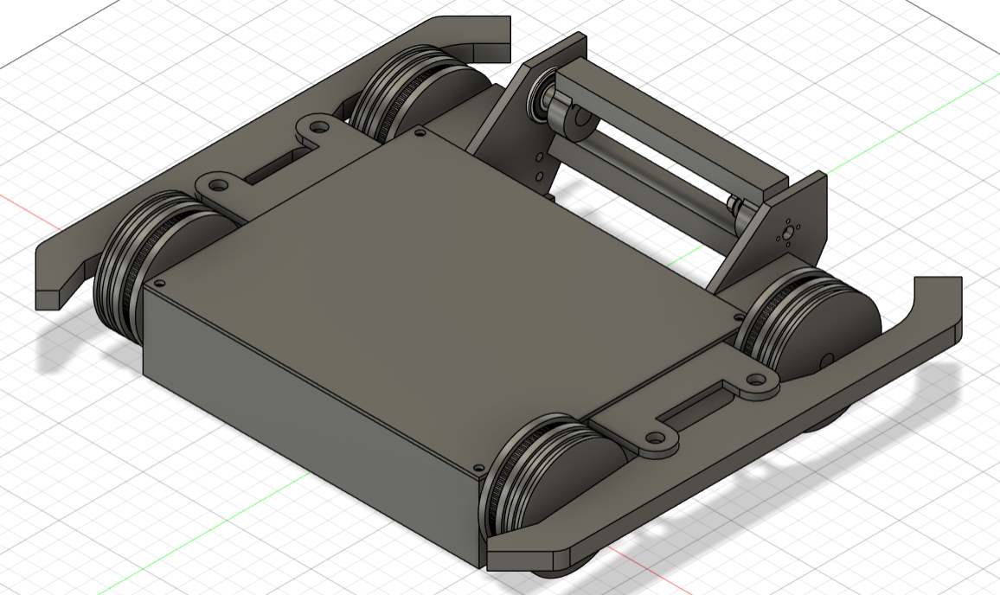

## Intro:
This is BB-Bot the ultimate budget bot. It is designed around "Broken Link Robotics's" "Split" combat robot. Although I tried to reverse engineer it completely but ultimately I settled on doing what made most sense for me. It is an eggbeater style combat robot. It utilizes two DC motors for drive and one 1407 drone motor for attack. The weapon is vertical spinner (eggbeater style).
## Chassis:
The chassis is pretty simple unlike the "Split". 

It is to be made of HDPE or TPU as it is flexible and shock absorpant.
## Wheel:
The wheels I designed are one of a kind. The initial "Split" wheel design was cool but I innovated it to use T2.5 belt to power front wheels as well. The wheels are to be made of TPU as well. It uses O-rings for grip.
    
## Weapon:
Now this is the fun part. This is eggbeater style vertical spinner. One tooth for greater impact made of Aluminum 4140 (not always, you can use what suits you best). It is mounted onto 1407 drone motor.

## Fenders:
They are for show only, I don't think they do any good in fight. Also made of TPU or HDPE.

## Whole Bot:
Here comes the BB-Bot.

## Parts:
2x JGB37-520 DC motors
Cytron MDD10A motor driver
BLHeli series 30A ESC
1407 Emax drone motor
50C 7.4V 2200mAH 2S Lipo Battery
XT60 connector
6000 2RS sealed ball bearings
O-rings